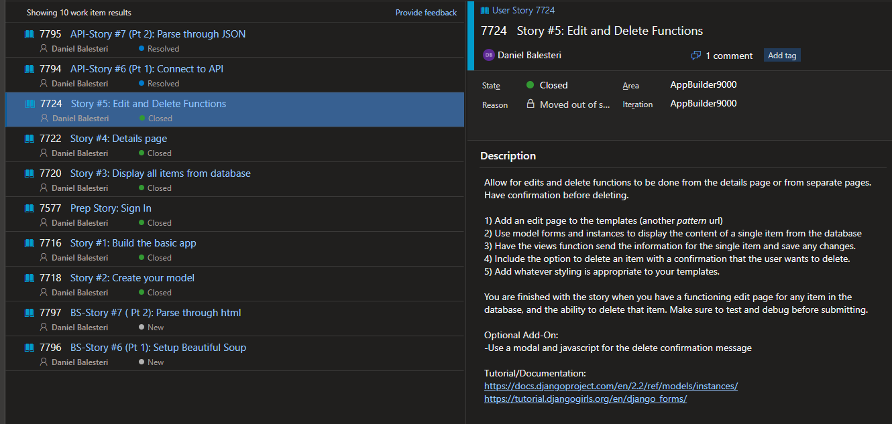
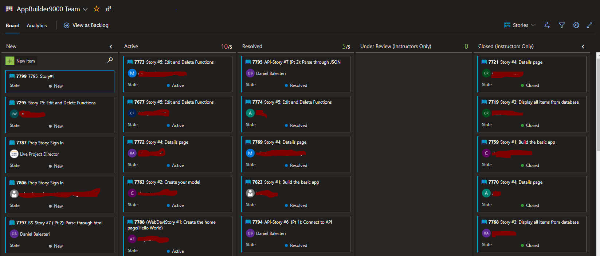
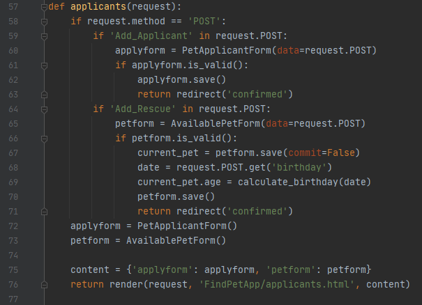
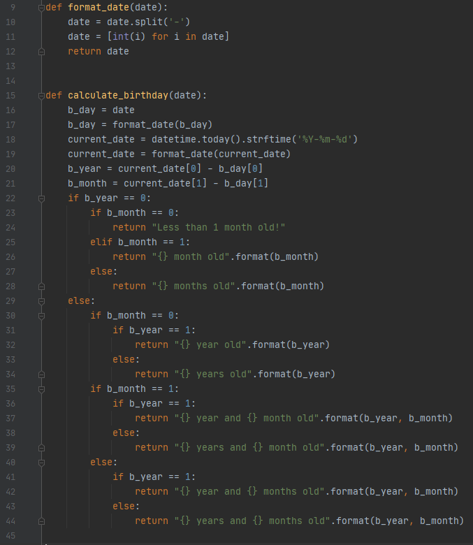

# Tech_Academy_Live_Project_Summary

Over the past two weeks, as part of the Software Development Bootcamp  with The Tech Academy, I was tasked to be part of a team creating our own site application that was part of a larger overarching project called App Builder 9000.

#### Appbuilder 9000 with various student sections


This Live Project involved utilizing Microsoft Azure for project management, Git as the VCS, PyCharm as the IDE, and the Django framework.

All students were assigned user stories to complete in the two week sprint, adding increasingly more functionality and design to their section for users to interact with database information, as well as a chosen API. These user stories covered both front-end and back-end work in increasing difficulty. The project was meant to teach students team skills with working with version control as part of a team, using a project management software, participating in daily SCRUM meetings, as well as technical skills with expanding on [using the Django framework's Model-View-Form structure to dynamically display database information to users](#database), and [interact with an API to display json data.](#json)

#### Azure assigned user stories:


#### Azure team story board



## I chose to make my section a pet rescue adoption site.


### <a name="database"></a>Interacting with the database:

The site allowed individuals to post pet listings to display with various fields saved to a AvailablePet model: Name, Birthday(using a date-picker widget), Breed, Color, Contact Email, Location(using dropdown list of state abbreviations), Animal Type(dropdown list of available animal types to choose from), and a Description field(using a Text Area widget). This model also had a char field called "age", which was populated directly through user input, but a result of a function I wrote passing in the submitted Birthday date-widget information as an argument.

It also allowed individuals to post themselves as willing applicants to be contacted directly with their preference in pet, saved to an PetApplicant model.

For functionality of two forms to work on the same page, I added statements to check which submit button was being used in the post-request. The screenshots below shows the view for the page, and the function for populating the "age" field in the pet model in my desired format.

#### View for application page


#### Age calculation function based on date-picker widget's Birthday field from user input


In viewing listings, the user is able to click more info, passing that pet's primary key into the url to view more details. The details page let's users delete the listing, with a pop-up modal asking if they're sure they want to delete that instance's name as defined in the modal: self.name + " the " + self.breed, and it also let's them edit the listing, with a confirmation page showing the pet instance's name they edited.

#### Edit pet listing example


### <a name="json"></a>Parsing through JSON data from API

This section of the project was tough, as the information returned from this API wasn't as straight forward to work with as others that I've encountered. The API request returned 3 dictionaries:

  1. "data" containing all pet listings
  2. "included" containing secondary data related to the pet listings such as picture links and species information
  3. "meta" containing meta data about the request

Parsing through this information had a few challenges:

  * First was that pet information was listed in the "data", with the picture links in the "included" dictionary. Pet listings would have a picture ID value that corresponded with a picture ID value in the "included" dictionary relating to 3 photos (small, medium, and large file sizes of the same photo). The difficult part was that "included" didn't only return pictures as it's dictionary items, it also returned specie information, so had to write how to pass by that information when parsing through "included" as a whole.
  
  * Second was that the pet listings weren't standardized. Sometimes there wouldn't be photos, and if there was no photos, there was no default value. That photo key didn't exist in that pet listing. There was also the possibility the pet had multiple photos uploaded. This made the "data" dictionary containing all the pets potentially much shorter than the "included" dictionary containing all of the possible photos. For example: a search of 25 pets would return 45 objects of photos and species information in the "included" dictionary.
  
To work with this, I created two while loops. The first was to get all possible picture IDs from the "included" dictionary (avoiding specie information) and add to a list. The second was to loop over every pet listing in "data". Each attribute of the pet I wanted, I added to corresponding lists. To get the correct picture, I had to use a for loop inside my while loop to check if that pet instance had a photo ID and if it did, cross check with the list of possible photo IDs, and if there was a match, add the corresponding picture url to a list.

The lists represented an individual pet in sequence. Then to display on the page, the lists were zipped to be looped through on the search results web page to be shown to the user.

#### View of search results:

```python
 def rescue_groups(request, animal_filter, number_of_results):
    if animal_filter == "dogs":
        animal_filter = "/dogs"
    elif animal_filter == "cats":
        animal_filter = "/cats"
    else:
        animal_filter = ""
        
    url = 'https://api.rescuegroups.org/v5/public/animals/search' + animal_filter + '?limit=' + str(number_of_results) + '&include=pictures,species&fields%5Banimals%5D=name,sex,breedPrimary,descriptionText,id,sizeGroup&fields%5Bpictures%5D=large&fields%5Bspecies%5D=singular'
    header = {
        'Authorization': 'my personal api key'
    }
    response = requests.get(url, headers=header)
    pet_data = response.json()
    breeds = []
    descriptions = []
    names = []
    sexes = []
    species = []
    picture_ids = []
    picture_urls = []
    pet_pictures = []

    j = 0
    while j < len(pet_data['included']):
        picture_id = pet_data['included'][j]["id"]
        file_size = pet_data['included'][j]['attributes'].get('large', 'No picture provided')
        if file_size == 'No picture provided':
            j += 1
            continue
        picture_url = file_size['url']
        picture_ids.append(picture_id)
        picture_urls.append(picture_url)
        j += 1

    i = 0
    while i < len(pet_data['data']):
        breed = pet_data['data'][i]['attributes']['breedPrimary']
        breeds.append(breed)
        description = pet_data['data'][i]['attributes'].get('descriptionText', "no description provided")
        descriptions.append(description)
        name = pet_data['data'][i]['attributes'].get('name', "not provided")
        names.append(name)
        sex = pet_data['data'][i]['attributes'].get('sex', "not provided")
        sexes.append(sex)
        specie_id = pet_data['data'][i]['relationships']['species']['data'][0].get("id", "not provided")
        if specie_id == "3":
            species.append("Cat")
        elif specie_id == "8":
            species.append("Dog")

        x = 0
        for p in picture_ids:
            relationships = pet_data['data'][i]['relationships']
            picture = relationships.get('pictures', "No picture provided")
            if picture == "No picture provided":
                break
            print(picture)
            data_picture_id = picture['data'][0].get('id', "0")
            if data_picture_id == p:
                picture = picture_urls[x]
                x += 1
                break
            else:
                picture = 'No picture provided'
                x += 1
        pet_pictures.append(picture)
        i += 1

    pet_list = zip(names, species, breeds, sexes, descriptions, pet_pictures)
    content = {'pet_list': pet_list}
    return render(request, 'FindPetApp/rescue_group.html', content)
```

The arguments for this view come from the filter view's user input:

```python
def rescue_groups_filter(request):
    form = FilterForm(data=request.POST)
    if request.method == "POST":
        if form.is_valid():
            animal_filter = request.POST.get('animal_filter')
            number_of_results = request.POST.get("number_of_results")
            return redirect('rescue_groups', animal_filter, number_of_results)
    context = {'form': form}
    return render(request, 'FindPetApp/rescue_groups_filter.html', context)
```

and passing into the url for the search results:
```python
path('rescue/<str:animal_filter>/<int:number_of_results>/', views.rescue_groups, name="rescue_groups"),
```
    
#### Listings from API:


## Conclusion & Skills Learned:

  * Working as a team with remote communication via Slack and participate in daily SCRUM meetings

  * Utilizing project management software, specifically experience with Azure, as well as utilizing VCS
  
  * Interacting with database information via Django, populating fields based on other field's post data, and displaying database info to users in a legible format
  
  * How to be adaptive in parsing through JSON data. Every API is different and being challenged with this project in particular improved my active problem solving skills
